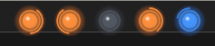

# Codex HUD

Codexの現在状態を、画面端に小さく持続表示するWindows HUDです。

Codex Desktopを別の作業と並行して使うときに、実行中、要対応、停止中のセッションを見失わないことを目的にします。

<table align="center">
  <tr>
    <td align="center">
      
      <br>
      <sub>複数セッションの混在表示</sub>
    </td>
    <td align="center">
      
      <br>
      <sub>Running / Stop の表示例</sub>
    </td>
  </tr>
</table>

## Features

- Codex Hookからセッション状態を読み取ります。
- セッションごとに状態ランプを表示します。
- `Running`、`NeedsAttention`、`Idle`を視覚的に区別します。
- `Stop`は、要対応状態を保ったまま、暗いグレーで表示します。
- タスクトレイからHUDの表示、位置編集、終了を操作できます。
- タスクトレイのツールチップに、起動状態とセッション状態の件数を表示します。
- EXEとタスクトレイに、青い専用HUDアイコンを表示します。
- HUDはCodexを操作しません。
- Hookの生データ、prompt、command、tool input、cwdをHUDへ渡しません。
- ランプは通常時にクリックを透過します。

## Current implementation

productionの最小経路は、次の構成です。

```text
Codex Hook
  → CodexHud.exe --hook
  → sanitized HookObservation
  → Named Pipe
  → SessionStateStore
  → WPF MainWindow
  → SkiaSharp lamp renderer
```

現在の実装は、`net10.0-windows`、WPF、SkiaSharp、Windows Named Pipeを使用します。

アプリケーションアイコンは[`src/CodexHud/Assets/CodexHud.ico`](src/CodexHud/Assets/CodexHud.ico)を使用します。

通常起動時は、タスクバーにボタンを表示せず、タスクトレイへアイコンを表示します。

タスクトレイからHUDを非表示にしても、Named PipeとSession State Storeは動作を続けます。

## Current verification

| Item | Status |
| --- | --- |
| Production bridge、Named Pipe、SessionStateStore、HUD | Implemented |
| Desktopでの`SessionStart`、`UserPromptSubmit`、`PermissionRequest`、`Stop` | Verified |
| Desktopでの`SessionEnd` | Not verified |
| Desktop Hookの遅延、重複、取りこぼし | Not verified |

未確認の挙動は、確定した仕様として扱いません。

## Quick start

### Requirements

For development:

- Windows
- .NET 10 SDK

For the release ZIP:

- Windows x64
- No .NET Desktop Runtime

The release ZIP is self-contained. It includes the .NET runtime and SkiaSharp native DLLs.

### Developer workflow

リポジトリのルートで実行します。

```powershell
dotnet build .\src\CodexHud\CodexHud.csproj -c Release
dotnet run --project .\src\CodexHud\CodexHud.csproj -c Release
```

引数なしで起動すると、HUDとNamed Pipe serverを起動します。

Release ZIPを作成します。

```powershell
pwsh -NoProfile -File .\tools\publish-release.ps1
```

ZIPは`artifacts\CodexHud-<version>-win-x64.zip`へ作成します。

### Package user workflow

ZIPを展開したフォルダーで、次の1コマンドを実行します。

```powershell
powershell -NoProfile -File .\Install-CodexHud.ps1
```

インストーラーは`app\CodexHud.exe`を確認します。

インストーラーは`%LOCALAPPDATA%\CodexHud\App`へアプリを配置します。

インストーラーはスタートメニューの`Codex HUD.lnk`をインストール先EXEへ更新します。

インストーラーは`SessionStart`、`UserPromptSubmit`、`PermissionRequest`、`Stop`、`SessionEnd`のHook dry-runを表示します。

既存のリポジトリ版HUD Hookが1つのコマンドだけの場合、その完全一致コマンドを削除対象として表示します。

旧HUD Hookコマンドが複数ある場合、インストーラーはHookを自動変更しません。

Enterlightなど、異なるHookコマンドは保持します。

内容を確認して`Y`を入力した場合だけ、`hooks.json`を書き換えます。

適用前に`hooks.json.backup-<timestamp>`を作成します。

`N`を入力した場合、Hookは変更しません。

Hook適用が成功した場合だけ、インストール先HUDを起動します。

インストール先HUDは管理者権限を要求しません。

インストール先HUDはレジストリ、Program Files、ログイン時スタートアップを変更しません。

状態ファイルは`%LOCALAPPDATA%\CodexHud\position.json`と`%LOCALAPPDATA%\CodexHud\sessions.json`へ保存します。

アンインストールは、ZIPを展開したフォルダーで実行します。

```powershell
powershell -NoProfile -File .\Uninstall-CodexHud.ps1
```

アンインストーラーは、インストール先EXEを指すHookだけをdry-runで削除対象にします。

確認後だけ`hooks.json`を変更します。

アンインストーラーは別のEXEを指すショートカットを削除しません。

アンインストーラーは`%LOCALAPPDATA%\CodexHud\App`だけを削除します。

`position.json`と`sessions.json`は残します。

### Developer start menu shortcut

Release EXEをbuildした後に、一度だけ実行します。

```powershell
dotnet build .\src\CodexHud\CodexHud.csproj -c Release
pwsh -NoProfile -File .\tools\install-start-menu-shortcut.ps1
```

以後は、Windowsのスタートメニューから`Codex HUD`を起動します。

リポジトリを移動した場合は、同じスクリプトを再実行してショートカットを更新します。

Windowsログイン時の自動起動は設定しません。

### Tests

```powershell
dotnet run --project .\tests\CodexHud.Tests\CodexHud.Tests.csproj -c Release
python -m unittest discover -s experiments -p 'test_*.py'
```

### Hook setup

Hookの確認とproduction bridgeへの切り替えは、バックアップ付きの手順を使います。

まずdry-runの結果を確認してください。

詳細は[`docs/hooks-setup.md`](docs/hooks-setup.md)を参照してください。

## Runtime modes

通常起動:

```powershell
CodexHud.exe
```

Hook bridge:

```powershell
CodexHud.exe --hook
```

`--hook`は標準入力を一回読みます。

bridgeは、許可されたイベント名と匿名化済みセッション識別子だけをNamed Pipeへ送信します。

## Design boundaries

- Session State Storeが現在状態の正を保持します。
- HUDはCodex固有のファイル形式やHook JSONを直接解釈しません。
- HUDから承認、回答入力、turn操作を実行しません。
- タスクトレイからCodexの承認、回答入力、turn操作を実行しません。
- 無更新、プロセス終了、ウィンドウ非表示だけで`Completed`や`Error`へ遷移しません。
- 複数モニター最適化、サウンド、粒子、3Dは現在の対象外です。

## Documentation

| Document | Description |
| --- | --- |
| [`docs/architecture.md`](docs/architecture.md) | アーキテクチャ、責務境界、状態モデル |
| [`docs/implementation.md`](docs/implementation.md) | 実装構成、build、テスト、手動受け入れ条件 |
| [`docs/hud.md`](docs/hud.md) | HUDの表示、操作、ランプ仕様 |
| [`docs/probe.md`](docs/probe.md) | Probeの検証計画と状態判定規則 |
| [`docs/hooks-findings.md`](docs/hooks-findings.md) | Hookの観測結果と未確認事項 |
| [`docs/hooks-setup.md`](docs/hooks-setup.md) | Hook Probeとproduction bridgeの設定手順 |
